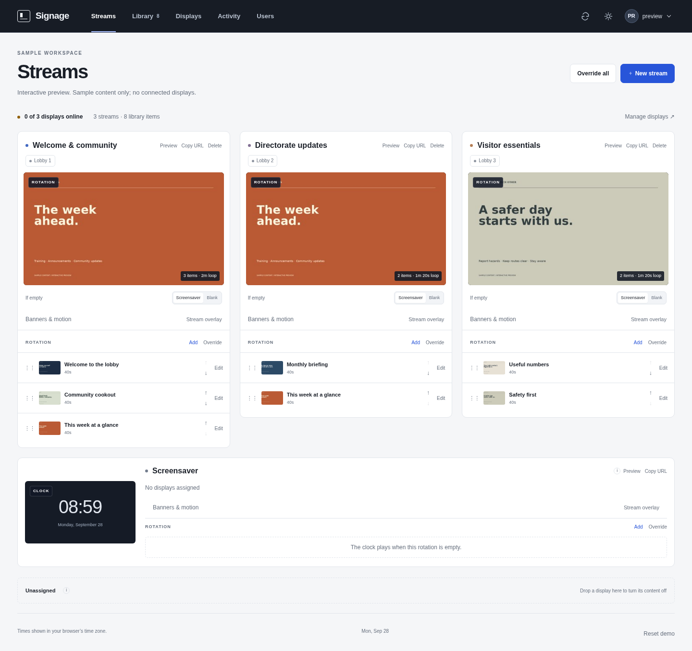

# Signage Portal

A self-hosted office signage system: ingest files, build reusable streams, and keep each display on one permanent playback address. Content, announcements and banners change in the portal, not in each display's configuration.



## Quick start

Run this on a Linux server. It installs Docker if it is missing, downloads the portal to `/opt/signage` and starts it on port 51480.

```sh
curl -fsSL https://raw.githubusercontent.com/xattribution/signage-portal/main/install.sh | sudo bash
```

When it finishes it prints the address, such as `http://192.168.1.20:51480`. Open it from a computer on the same network. A setup page asks for a workspace name and an administrator account, and then you are in the workspace. Everything else is on the **Settings** page.

To put a screen on it, set the Cast Pro to Web mode and give it the display address shown on the **Displays** page, for example `http://<server-ip>:51480/display/lobby-1`. You never need to change that address again.

### Update, back up, restore, uninstall

```sh
# Update to the latest version (backs up the database and settings first)
curl -fsSL https://raw.githubusercontent.com/xattribution/signage-portal/main/install.sh | sudo bash -s update

# Back up everything to /var/backups/signage
curl -fsSL https://raw.githubusercontent.com/xattribution/signage-portal/main/install.sh | sudo bash -s backup

# Restore a backup on this server or a new one (installs the portal first if needed)
curl -fsSL https://raw.githubusercontent.com/xattribution/signage-portal/main/install.sh | sudo bash -s restore /var/backups/signage/<backup-file>.tar

# Uninstall (your data is kept; add --purge to delete it, which makes a final backup first)
curl -fsSL https://raw.githubusercontent.com/xattribution/signage-portal/main/install.sh | sudo bash -s uninstall
```

After the first install the same commands are also available as `sudo signage update`, `sudo signage backup`, `sudo signage restore <file>` and `sudo signage uninstall`.

A backup is a single `.tar` file. It holds the database (accounts, settings, streams, displays and schedules), the secret key, all uploaded and converted content, your `.env`, the NAS settings and credentials in `/etc/signage`, and the systemd units. It works the same for the quick-start install and for NAS storage. To move to a new server, copy the file across and run the restore command there. The file contains password hashes and NAS credentials, so keep it somewhere private.

### Common changes

| To do this | Do this |
|---|---|
| Use a different port | Put `SIGNAGE_PORT=52000` in `/opt/signage/.env`, then run the update command |
| Reach it by a name such as `signage.office.lan` | Add the name under **Settings → Access names** (IP addresses always work) |
| Require a code on the setup page | Put `SETUP_TOKEN=your-code` in `/opt/signage/.env` before the first visit, then run the update command |
| Add HTTPS, NAS storage, Cloudflare or systemd startup | Follow [Installation](docs/INSTALL.md) |
| Run it without the installer | `git clone https://github.com/xattribution/signage-portal.git && cd signage-portal && docker compose up -d` |

The portal serves plain HTTP on your network. Sign-in cookies switch to secure mode automatically when the portal is reached over HTTPS, so put it behind a TLS proxy before using it outside a trusted network.

**Staging candidate.** Source and local test evidence are included. A clean release build, NAS reboot testing and physical-display acceptance remain required. No UniFi controller API integration is included.

## Guides

| Task | Guide |
|---|---|
| Production install with HTTPS, NAS storage and systemd | [Installation](docs/INSTALL.md) |
| Publish this source to a private GitHub repository | [GitHub publishing](docs/GITHUB.md) |
| Mount NAS storage and recover after reboot | [Persistence](docs/PERSISTENCE.md) |
| Configure stable playback URLs or external sources | [Streams and sources](docs/STREAMS-AND-SOURCES.md) |
| Add ribbons, countdowns, graphics and transitions | [Banners and motion](docs/OVERLAYS.md) |
| Understand status indicators | [What the UI actually measures](docs/STATUS.md) |
| Back up, update or troubleshoot | [Operations](docs/OPERATIONS.md) · [Upgrade details](docs/UPGRADING.md) |
| Review executed checks and remaining limits | [Current validation](docs/REPOSITORY-VALIDATION.md) |

## The operating model

**Library → Stream → Display.** Upload images, videos, PowerPoint/PDF decks and graphics, import from approved NAS folders, or add an approved URL source. Place content in a rotation or a time-bounded override. Assign each playback destination to a stream.

Configure a Cast Pro in Web mode once with its permanent display URL:

```text
https://play.your-office.example/display/lobby-1
```

A subsequent stream reassignment, content edit, banner change or server restart does not change that address. A direct `/stream/<persistent-key>` address follows one particular stream instead. The hostname and saved data must remain stable.

Playback endpoints expose no content-management controls. A separate playback hostname rejects administrative routes and content mutations. **View-only is not private viewing:** anyone allowed to reach the playback endpoint can view its content. Use the appropriate network boundary and TLS.

## What is included

Streams have rotations, scheduled overrides and Screensaver/Blank fallbacks. The overlay editor adds independent top/bottom ribbons, text tickers, clocks, countdowns, graphic inserts, copied presets, optional schedules and configurable transitions. The Screensaver can use clock artwork or its own content rotation.

The NAS browser supports approved incoming/outgoing folders, snapshot imports and no-overwrite exports. Media, stream assignments, presentation settings and transfer records persist in the configured storage; host mount/startup templates guard against missing or incorrect shares.

The administrator workspace has one responsive top bar, light/dark/system themes, keyboard-accessible controls and a neutral Refresh button. Warnings appear when data refresh fails; there is no always-green global “Connected” badge.

## Architecture

```text
Admin browser ── HTTPS ──► Web service ──► SQLite + secrets on local disk
Display player ─ HTTPS ─► View-only player routes and validated media
                                │
                          NAS originals + job tickets
                                ▼
                  Isolated, network-less conversion worker
                                │
                         Untrusted work output
                                ▼
                    Web validates and publishes renditions
```

The web service handles authentication, scheduling, API requests and validated media delivery. The worker handles Office/PDF/video/image parsing; it has no network, database, secret or rendered-media mount. SVG input is restricted and rasterized; raw SVG is not served. HLS support is installed from a checksum-pinned upstream release during the web image build.

This is a **single-host, single-web-process application**. Do not scale Uvicorn workers or Compose replicas. Keep SQLite on persistent local disk, not SMB/NFS. NAS content is stored separately by trust level.

## Important boundaries

The composed stream is an **HTML player**, not a universal RTSP/HLS-encoded output. Overlays are drawn by the player, not burned into an independent relay. Live HLS sources require compatible codecs and origin/CORS configuration. The optional MediaMTX relay is an operator-configured example; it is not a built-in arbitrary-URL proxy or transcoder.

PowerPoint animation and embedded video are not preserved when decks become still slides. Software-clock synchronization is not frame-locked broadcast distribution. Saved playlists do not constitute a complete offline media cache. NAS outages can interrupt playback even though configuration persists.

The portal does not log into UniFi, adopt devices, set physical power/volume, manage firmware or change controller settings. **Changing the assigned stream in this portal still works through each display's permanent URL.** “Off” blanks that player; it does not power off the television. All portal administrator accounts currently have full permissions; roles and approval workflows are not implemented.

## Local development and checks

Use a clean Python 3.12 environment and Node.js 22 or newer. The graphics tests need Cairo; full converter testing also needs ffmpeg, LibreOffice and poppler.

```sh
python3.12 -m venv .venv
. .venv/bin/activate
python -m pip install -r requirements-dev.txt
./scripts/check.sh
```

Tests use temporary storage, not your deployment database. [CONTRIBUTING.md](CONTRIBUTING.md) covers browser checks and development boundaries. A GitHub Actions workflow is supplied to install the release pins and run regression/syntax checks after publishing. It has not run on GitHub in this session and does not deploy the service.

Generate the standalone, sample-data preview:

```sh
python scripts/build-workspace-demo.py --output workspace-preview.html
```

Open the resulting HTML file in a browser. This is an in-memory demonstration, not the running backend or a display-health test. Never enter real credentials into it.

## Repository contents

`web/` contains the API and player/admin assets; `worker/` contains isolated converters; `deploy/` contains host mount, proxy, systemd and optional relay examples; `tests/` and `scripts/` contain checks and operator tooling. `docs/` contains guides and evidence. Earlier revision records are retained as history, not current release certification.

Runtime data, NAS content, credentials and `.env` do not belong in Git. No project-wide open-source license has been selected in this preparation pass; see [third-party notices](THIRD_PARTY.md) before distribution. GitHub hosts this repository's source and documentation; the running service belongs on your own Docker host.
